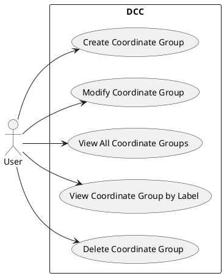
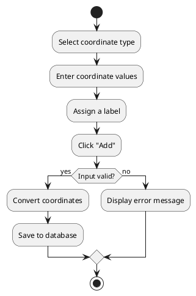
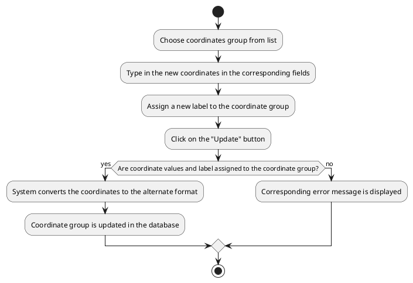
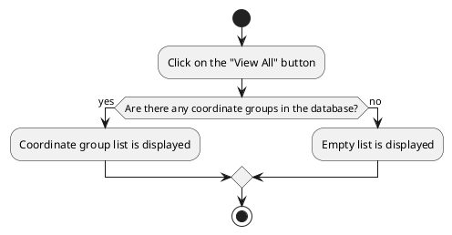
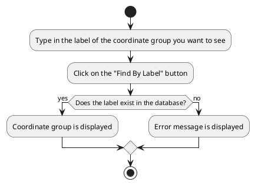
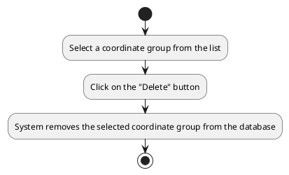
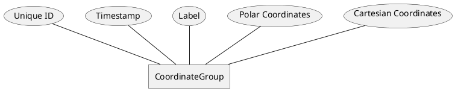

# Software Requirements Specification (SRS)

---

# Dummy Coordinate Converter Application

---

## 1. Introduction

### 1.1 Purpose
The Dummy Coordination Conversion Application (DCC app) is an application that manages coordinate groups in Cartesian and Polar formats. The app allows users to input, convert, store, retrieve, modify, and delete coordinate groups.

### 1.2 Scope
This application serves as a lightweight tool for managing coordinate groups, used in several calculations by students, engineers, educators, etc.. It provides a GUI developed with Java Swing and supports essential operations such as coordinate conversion, storage, and retrieval. This document contains the requirements specification of the DCC app.

### 1.3 Definitions, Acronyms, and Abbreviations

- **Cartesian Coordinates:**
A type of coordinate representation that specifies a point's location using two values: 𝑥 (horizontal position) and 𝑦 (vertical position). Example: (x, y).

- **Polar Coordinates:**
A type of coordinate representation that specifies a point's location using a radius (𝑟) and an angle (𝜃), measured from the origin. Example: (𝑟, 𝜃).

- **Coordinate Group:**
A collection of coordinates that includes both Cartesian and Polar representations. 

- **GUI**: Graphical User Interface.

### 1.4 References  
- Polar coordinate system: https://en.wikipedia.org/wiki/Polar_coordinate_system  
- Cartesian coordinate system: https://en.wikipedia.org/wiki/Cartesian_coordinate_system  
- Java runtime environment: https://en.wikipedia.org/wiki/Java_(software_platform)#Java_Runtime_Environment  
- Java Swing Framework: [https://docs.oracle.com/javase/8/docs/technotes/guides/swing/](https://docs.oracle.com/javase/8/docs/technotes/guides/swing/)
- MySQL Documentation: [https://dev.mysql.com/doc/](https://dev.mysql.com/doc/)

### 1.5 Overview
This document outlines the software requirements for the DCC Application, detailing functional and non-functional requirements, data organization, and interface expectations. It is structured to facilitate both development and validation processes.

---

## 2. System Overview

### 2.1 Product Perspective
The DCC Application operates as a standalone desktop application, that runs in all modern operating systems (windows, macos and linux). It uses a MySQL database for backend storage and Java Swing for the user interface. Its primary goal is to simplify coordinate system transformations and management.

### 2.2 Product Functions
- Create, view, modify, and delete coordinate groups.
- Convert coordinates between Cartesian and Polar systems.
- Store coordinate groups persistently in a database.

### 2.3 User Characteristics
The intended users are students, engineers, educators, that need to convert between coordinate systems. No special technical skills are required to operate the software.

### 2.4 Operating Environment
- **Hardware**: Any computer that can run a JRE.
- **Software**: Java Runtime Environment (JRE) 8 or higher, MySQL Server 8.0 or higher.
- **Network**: Required for database access.

### 2.5 Assumptions and Dependencies
- The application requires a connection to a MySQL database.
- The Java Swing library is required for running the application's GUI
- A JDBC connector is required for database communication.

---

## 3. Functional Requirements

### 3.1 Functional Requirements Specification

1. Define cartesian coordinates as a pair (x, y) of high-precision numbers
2. Define polar coordinates as a pair (r, θ) of high-precision numbers
3. Convert cartesian (x, y) to polar (r, θ) coordinates
4. Convert polar (r, θ) to cartesian (x, y) coordinates
5. Create a unique auto-generated integer identifier (id) for the coordinate group edited, add a timestamp, and save the label and the values of the coordinates group as a new record into the database
6. Create a list of all saved coordinate group records. For each record, show: id, label, cartesian coordinate values, polar coordinate values, datetime added or modified), sorted by id
7. Update a coordinate group record with new values entered by the user and save the updated record of the coordinates group into the database
8. Delete a coordinate group record from the database
9. Provide error handling for invalid inputs.

### 3.2 Use Cases

#### 3.2.1 Use Case Diagram

#### 3.2.2 Use Case 1: Create Coordinate Group
- **Use Case ID**: UC1
- **Actors**: User  
- **Execution environment:**  The execution environment for this use case is the graphical user interface (GUI). This interface provides all the required buttons and controls to facilitate user interactions.  

- **Preconditions**: The application must be running.

** VV->GS ADD INPUT DATA EXACTLY AS IN v1a ***

- **Main Flow**:  
**Step 1:** Choose source coordinate type from drop down menu (either Cartesian or Polar).  
**Step 2:** Fill in the values of the coordinates in the corresponding fields.   
**Step 3:** Assign a label to the coordinate group by filling the corresponding field.  
**Step 4:** Press the "Add" button.  
**Step 5:** The app converts coordinates to the alternate format and stores them in the database.
- **Alternate Flow**:
  - If the input is invalid, the system displays an error message.
- **Postconditions**:  
a) The new coordinate group is saved in the database.  

- **Related Diagrams**: UML Activity Diagram (see below).

*** VV->GS ADD OUTPUT DATA EXACTLY AS IN v1a ***

#### 3.2.3 Use Case 2: Modify Coordinate Group
- **Use Case ID**: UC2
- **Actors**: User  
- **Execution environment:**  The execution environment for this use case is the graphical user interface (GUI). This interface provides all the required buttons and controls to facilitate user interactions.  

- **Preconditions**:   
a) an active connection to the database  
b) the existence of the coordinate group that is intended to be modified.  

*** VV->GS ADD INPUT DATA EXACTLY AS IN v1a ***

- **Main Flow**:  
**Step 1:** Choose coordinate group from a list.  
**Step 2:** Fill in the new values of the coordinates in the corresponding fields.  
**Step 3:** Assign the new label in the corresponding field.  
**Step 4:** Press the "Update" button in the User Interface.  
- **Alternate Flow**:
  - If input is invalid, the system displays an error message.  
  
- **Postconditions**:  
a) The coordinate group is updated in the database.  

- **Related Diagrams**: UML Activity Diagram (see below).

*** VV->GS ADD OUTPUT DATA EXACTLY AS IN v1a ***

#### 3.2.4 Use Case 3: View All Coordinate Groups
- **Use Case ID**: UC3
- **Actors**: User  
- **Execution environment:**  The execution environment for this use case is the graphical user interface (GUI). This interface provides all the required buttons and controls to facilitate user interactions.  

- **Preconditions**:  
a) an active connection to the database   

*** VV->GS ADD INPUT DATA EXACTLY AS IN v1a ***

- **Main Flow**:  
**Step 1:** Press the "View All" button in the User Interface.  
**Step 2:** Retrieve all stored coordinate groups from the database.  
**Step 3:** View the list of coordinates.  

- **Postconditions**:  
a) A list of coordinate groups is displayed.  

- **Related Diagrams**: UML Activity Diagram (see below).

*** VV->GS ADD OUTPUT DATA EXACTLY AS IN v1a ***

#### 3.2.5 Use Case 4: View Coordinate Group by Label
- **Use Case ID**: UC4
- **Actors**: User  
- **Execution environment:**  The execution environment for this use case is the graphical user interface (GUI). This interface provides all the required buttons and controls to facilitate user interactions.  

- **Preconditions**:   
a) an active connection to the database  

*** VV->GS ADD INPUT DATA EXACTLY AS IN v1a ***

- **Main Flow**:  
  **Step 1:** Type in the label in the corresponding field in the User Interface.  
**Step 2:** Press the "Find by Label" button.  
**Step 2:** Retrieve the coordinate groups from the database that satisfy the search criteria.   
**Step 3:** View the retrieved groups of coordinates in a list.  

- **Postconditions**:  
a) The selected coordinate group is displayed.

- **Related Diagrams**: UML Activity Diagram (see below).

*** VV->GS ADD OUTPUT DATA EXACTLY AS IN v1a ***

#### 3.2.6 Use Case 5: Delete Coordinate Group
- **Use Case ID**: UC5
- **Actors**: User  
- **Execution environment:**  The execution environment for this use case is the graphical user interface (GUI). This interface provides all the required buttons and controls to facilitate user interactions.  

- **Preconditions**:   
a) an active connection to the database  
b) there is at least one coordinates group in the database

*** VV->GS ADD INPUT DATA EXACTLY AS IN v1a ***

- **Main Flow**:  
**Step 1:** Select a coordinate group from the coordinate group list.  
**Step 2:** Press the "Delete" button.  
**Step 3:** System removes the selected coordinate group from the database.  

- **Postconditions**:  
a) The selected coordinate group is deleted.  

- **Related Diagrams**: UML Activity Diagram (see below).

*** VV->GS ADD OUTPUT DATA EXACTLY AS IN v1a ***

---

## 4. Non-Functional Requirements

### 4.1 Performance Requirements
- The system shall process user inputs and database operations within 2 seconds.

### 4.2 Usability Requirements
- The GUI shall be simple and comprehensive, with clear labels and buttons.

### 4.3 Security Requirements
- The system shall authenticate to the database using a secure username and password.

### 4.4 Availability Requirements
- The app should be able to maintain 90% uptime during operation hours.

### 4.5 Scalability Requirements
- The system shall support up to 100,000 (one hundrend thousand) coordinate groups without performance degradation.

### 4.6 Compliance Requirements
- The system shall adhere to applicable data handling and privacy laws.

---

## 5. Data Requirements

### 5.1 Data Models
Each coordinate group shall include:
- Auto-generated unique primary key (integer)
- Timestamp (automatically assigned the date and time of group creation)
- Unique user-defined label for identification
- Coordinates in Polar format (r, θ)
- Coordinates in Cartesian format (x,y)  

The following conceptual Entity Relationship Diagram describes the high-level design of the database. 

### 5.2 Data Storage
- Data shall be stored in a MySQL database with proper indexing for performance.

### 5.3 Data Access
- The system shall use a JDBC connection for database access.

### 5.4 Data Validation
- Coordinate values must adhere to valid ranges (e.g., θ in [0, 360] degrees).

---

## 6. Interface Requirements

### 6.1 User Interfaces
- The GUI shall include input fields, dropdowns, and buttons for all core functionalities.
- The UI shall include:
  - Main menu with navigation options.
  - Forms for creating and modifying coordinate groups.
  - Display list for viewing coordinate groups.

### 6.2 External Interfaces
- The system shall interface with a MySQL database via JDBC.

---

## 7. System Constraints

### 7.1 Design Constraints
- The system shall use Java Swing for the GUI.
- The database must be MySQL.

### 7.2 Environmental Constraints
- The application must run on systems with Java 8 or later JRE installed.

---

## 8. Verification and Validation

### 8.1 Verification Plan
- Unit tests shall verify all functional requirements.
- Integration tests shall validate the integration with the DBMS service.

### 8.2 Validation Plan
- User acceptance testing shall confirm that the system meets the users' expectations for simplicity and efficiency in the user interface.

### 8.3 Traceability Matrix
- Each requirement shall be mapped to test cases to ensure coverage.

---

## 9. Appendices

### 9.1 Glossary
- **GUI**: Graphical User Interface
- **JDBC**: Java Database Connectivity

### 9.2 References
- See Section 1.4 for detailed references.

### 9.3 Change History
- Version 1.0: Initial release of the DCC Application SRS.

---
### Some extra notes marina
📌 1. Purpose of the SRS

The SRS is the blueprint for your software.

It answers:

What are we building?

Why?

For whom?

How should it behave?

It must be precise and unambiguous.

📌 2. Main Sections You Must Include
### 1. Introduction

Purpose of the system

Scope

Definitions, acronyms

Stakeholders (User, Admin, External Services)

2. Overall Description (System Overview)

Product perspective

What the system connects to (database, server, APIs)

Product functions

High-level overview (login, profile, map, reservations, statistics, payments, etc.)

User characteristics (skills, personas)

Constraints

Hardware, software, regulatory constraints

Performance expectations

Assumptions & Dependencies

3. Functional Requirements

These describe what the system must do.

For each use-case (ex. Login, Select Profile, Show Statistics, Reserve Charger, Start Charging), define:

Preconditions

Main flow

Alternative flows

Error handling

Postconditions

Each requirement must be uniquely numbered:

FR-1: User Login

FR-2: User Profile Selection

FR-3: Fetch User Statistics

FR-4: Reserve Charger

FR-5: Payment Handling

FR-6: Start Charging

FR-7: Timer Expiration → Notify User

4. Non-Functional Requirements

Usability

Reliability

Performance

Scalability

Security

Availability

Portability

UI constraints

This section shows that your system respects engineering quality criteria — very important.

5. System Models (Mandatory for your project)

You must include:

✔ Use Case Diagram

Shows actors and actions.

✔ Activity Diagrams

Show the workflow of each main feature.

✔ Sequence Diagrams

Show message flow between:

User

App

Web Server

Database

This is exactly what we have been building together.

You must show:

Authentication flow

Profile retrieval

Statistics display (possibly parallel)

Reservation flow

Payment flow

Start/Stop charging

Timer expiration event

✔ Class Diagram

Shows the structure:

Classes

Attributes

Methods

Relationships (association, dependency, aggregation)

✔ Component Diagram

Shows how system modules communicate:

Web App

Server

Database

External services (payment, authentication)

6. System Architecture

A clear diagram with:

Frontend layer

Backend layer

Database layer

External API services

Shows how everything fits together.

7. Data Model

ER Diagram or Database schema

Entities: User, Charger, Reservation, Payment, Usage Stats

Relations between entities

📌 3. What You Need to Do in the Sequence Diagrams

Your diagrams must reflect the system logic.

For example, for Login + Load Statistics:

User → App: Enter credentials

App → Server: Authenticate

Server → Auth Service: Validate credentials

Auth Service → Server: Token

Server → Database: Fetch profile data

Server → Database: Fetch charging statistics

Server → App: Return combined data

App → User: Display profile & stats (parallel)

This is exactly what you asked me to help you refine — and yes, your breakdown into Actor, Web App, Web Server, Authentication Service, and Database is correct.

📌 4. What the Server vs Database Holds

You must clearly understand this:

Server

No permanent data stored

Contains business logic

Validates user actions

Communicates with external services (auth, payments)

Decides what the data “means”

Database

Stores all persistent data:

Users

Profiles

Reservations

Charger info

Statistics

Payments

This distinction is crucial for your diagrams.

📌 5. What You Deliver as Final Project

Your submission will include:

√ Full SRS document
√ UML diagrams:

Use Case

Activity

Sequence (multiple)

Class

Component

Deployment (optional but recommended)

√ System architecture diagram
√ Basic mockups (optional but increases grade)
√ Short presentation