# Electric Vehicle Charging Management Application
# Software Requirements Specification Document

## 1. Introduction

### 1.1 Purpose

##### Block Diagram
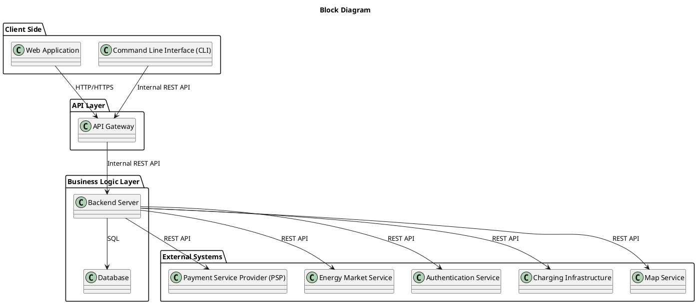

The **Electric Vehicle Charging Management Application (EV CMA)** is software developed for a single charging‑network provider.  

Its purpose is to enable the provider to offer and manage electric‑vehicle charging services through web and smartphone applications, while maintaining administrative control through a command‑line interface.

The system allows electric‑vehicle users to:

- Create accounts  
- Locate and reserve charging stations  
- Start and stop charging sessions  
- Pay securely through integrated payment services  

<!--
It also enables automatic handling of dynamic pricing based on factors such as location, requested charge power, time of day, and wholesale energy prices.
-->

For the provider, the application supports:

- Data management  
- Pricing configuration  
- Monitoring of station status  
- Reporting  

<!--
Additionally, it exposes programmable interfaces for third‑party systems (e.g., mapping platforms, energy‑market data sources, and payment providers) to exchange information about charger availability, pricing, and energy usage.
-->

**Overall Goal:**  
Provide a unified and efficient software solution that improves the charging experience for users and streamlines operations for the provider.
> **Stakeholders:** User (EV Driver), Admin, External Services (Payment Service, Energy Market, Authentication Service, Map Service, Chargers)

---

### 1.2 Interfaces

#### 1.2.1 Interfaces to External Systems

The **Electric Vehicle Charging Management Application (EV CMA)** communicates with external systems for payment, real‑time pricing, map integration, and data sharing with mobility platforms.

##### Identification of External Systems

| External System | Description |
|------------------|-------------|
| **Payment Service Provider (PSP)** | Processes user payments and refunds via secure REST API. |
| **Energy Market Service** | Provides live wholesale pricing data for dynamic tariff calculation. |
| **Charging Infrastructure / Chargers** | Network of connected EV chargers exchanging real‑time status, start/stop commands, and metering data with the system. |
| **Authentication Service** | Manages user identity, login tokens, and authorization policies for both clients and backend components, using OAuth 2.0 / OpenID Connect standards. |
| **Mapping and Routing APIs** | Used to display and navigate to charging stations (e.g., Google Maps, OpenStreetMap). |
| **User Devices** | Web browsers and mobile apps connecting through HTTPS to the provider’s REST API. |

##### Applicable Standards and Protocols

- **RESTful HTTP / HTTPS**  
- **OAuth 2.0 / OpenID Connect**  
- **JSON** (data format)  
- **TLS 1.2 or higher** (security)  
- **PCI‑DSS** — for payment security

##### UML Component Diagram

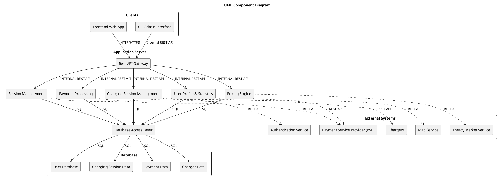
#### 1.2.2 User Interfaces
---
#### **View and Reserve**

  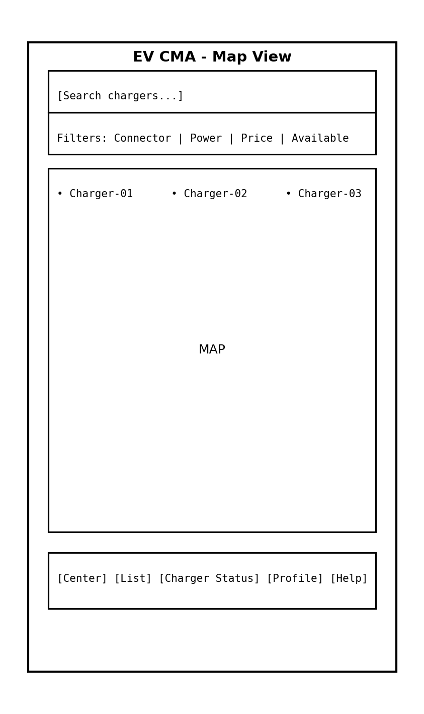
  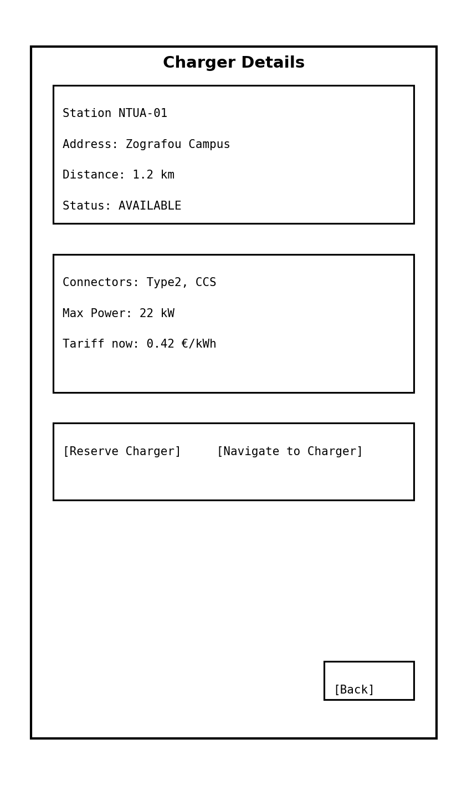
  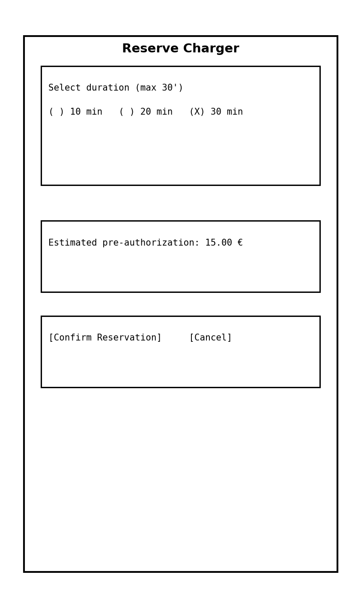
  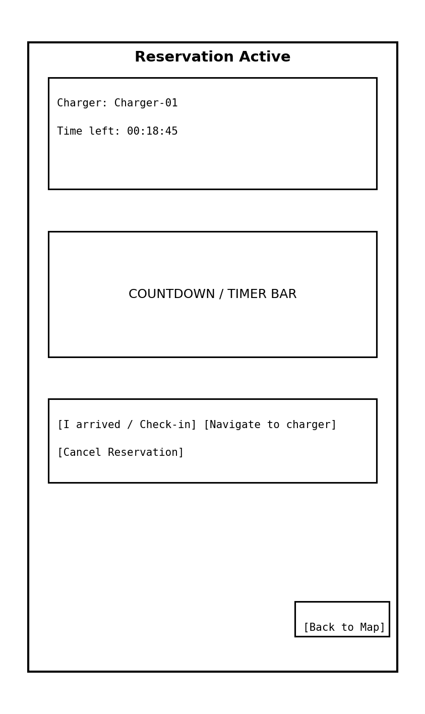

---

#### **Charging and Details**

  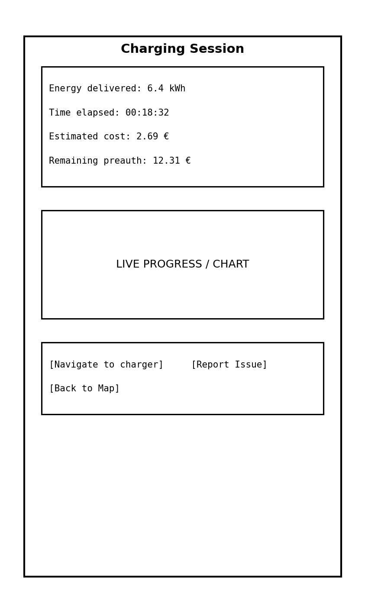
  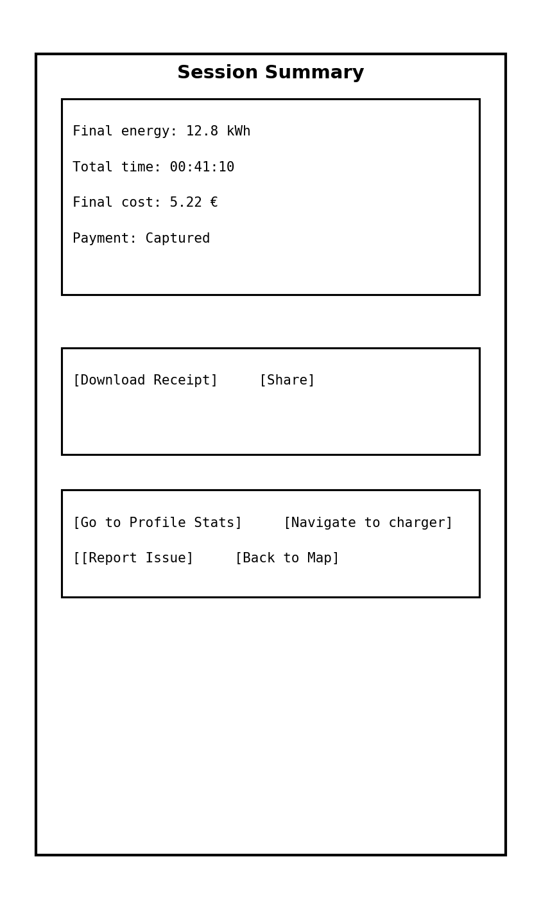
  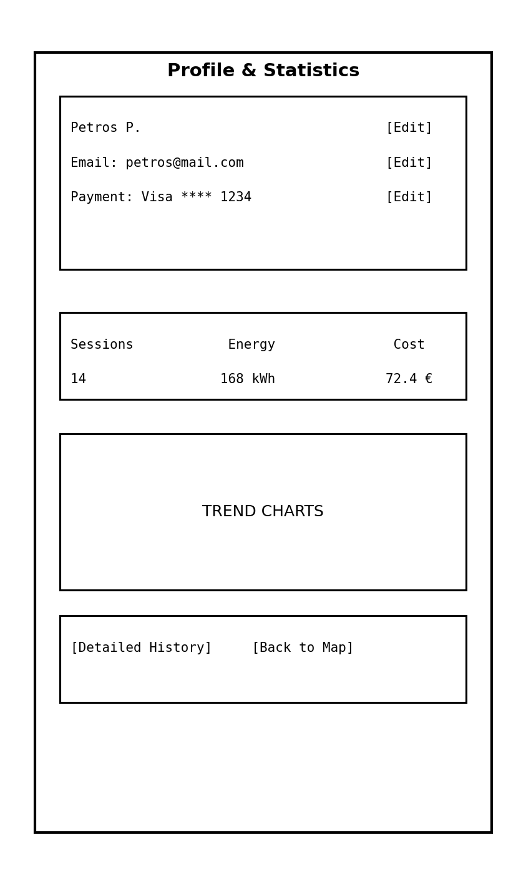
  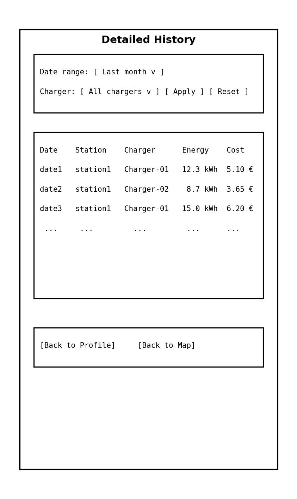

 

##### EV CMA – Screen Navigation Flow

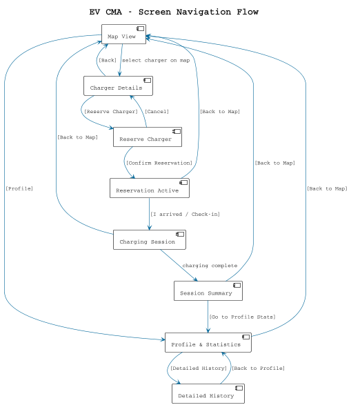
---

## 2. References
### 2.1 Links to information sources

General sources:
https://helios.ntua.gr/pluginfile.php/2767/mod_resource/content/2/Software%20Requirements%20Specifications_%20How%20To%20Write%20SRS%20with%20Examples%20%E2%80%93%20BMC%20Blogs.pdf
https://helios.ntua.gr/mod/resource/view.php?id=12705

Sequence Diagrams:
https://www.geeksforgeeks.org/system-design/unified-modeling-language-uml-sequence-diagrams/
https://www.lucidchart.com/pages/uml-sequence-diagram

Block Diagrams:
https://miro.com/diagramming/what-is-a-block-diagram/
https://www.smartdraw.com/block-diagram/
https://www.conceptdraw.com/How-To-Guide/uml-block-diagram

Activity Diagrams:
https://www.geeksforgeeks.org/system-design/unified-modeling-language-uml-activity-diagrams/
https://www.uml-diagrams.org/activity-diagrams-examples.html
https://www.lucidchart.com/pages/tutorial/uml-activity-diagram
https://venngage.com/blog/activity-diagram/

Security Requirements:
https://www.youtube.com/watch?v=6ZEsnxHIjjA
https://cadabrastudio.medium.com/mobile-app-security-requirements-complete-guide-for-regulated-industries-f5df622bdab7
https://www.securitycompass.com/blog/understanding-application-security-requirements/

Functional Requirements:
https://www.nuclino.com/articles/functional-requirements
https://decode.agency/article/functional-requirements-examples/

Performace Requirements:
https://www.ibm.com/docs/en/aix/7.2.0?topic=implementation-performance-requirements-documentation

Data Requirements:
https://qat.com/guide-writing-data-requirements/
https://www.promodel.com/onlinehelp/promodel/80/C-03%20-%20Determining%20Data%20Requirements.htm

Functional Requirements:
https://www.geeksforgeeks.org/system-design/how-to-identify-functional-requirements/
https://www.interaction-design.org/literature/topics/functional-requirements#what_are_functional_requirements?-0

Use Case Diagrams:
https://medium.com/@60949161/use-cases-to-model-processes-1fb77d4efb30
https://www.figma.com/resource-library/what-is-a-use-case/

### 2.2 Glossary of terms
EV (Electric Vehicle): *A vehicle powered entirely or partially by electric power, typically using rechargeable batteries.*

CMA (Charging Management Application): *A software solution that manages the electric vehicle charging infrastructure and user interactions, including scheduling, payments, and usage statistics.*

API (Application Programming Interface): *A set of protocols and tools that allows software applications to communicate with each other.*

REST (Representational State Transfer): *An architectural style for designing networked applications, typically using HTTP for communication.*

JWT (JSON Web Token): *A compact, URL-safe means of representing claims to be transferred between two parties, often used for authentication.*

TLS (Transport Layer Security): *A cryptographic protocol used to secure communications over a computer network, typically employed to protect HTTPS communications.*

Charger: *A device used to provide power to an electric vehicle, typically installed at public charging stations or at home.*

Reservation: *The process by which a user selects and books a charging station for future use.*

Session: *A period of time during which an electric vehicle is connected to a charger and power is being delivered.*

Telemetry: *Data collected from a device (such as a charger) that provides real-time information about its status and operation.*

Backend: *The server-side of a software application that handles business logic, data storage, and other critical operations.*

Frontend: *The client-side part of an application that interacts with the user, usually implemented using web or mobile technologies.*

Admin CLI (Command Line Interface): *A text-based interface used by administrators to manage and monitor the system, typically used for configuration, maintenance, and reporting tasks.*

Payment Provider: *A service that handles the processing of payments, including pre-authorization and final billing for charging sessions.*

Tariff: *A pricing plan that dictates how much users pay for the energy consumed during a charging session, potentially varying by time of day or location.*

Energy Market: *A system or platform where wholesale electricity prices are set, often influenced by supply and demand dynamics.*

Charger Status: *The current condition of a charger, which can be "available," "in use," or "offline."*

User Profile: *A user’s personal information, such as name, contact details, vehicle information, and payment preferences.*

Payment Method: *A method of payment (e.g., credit card, debit card, e-wallet) stored for future use by the system to handle transactions.*

User Statistics: *Metrics related to a user’s activity within the system, including historical charging data, total energy consumed, and cost summaries.*

Reservation Duration: *The time period for which a charger is reserved, typically up to a maximum time limit.*

Charging Session Monitoring: *The process of tracking and displaying real-time data (such as energy delivered, charging time, and cost) during an active charging session.*

Session History: *A log of past charging sessions, including data such as the total energy consumed, the cost, and the time spent charging.*

CLI Admin (Command Line Interface Administrator): *An administrative user who manages system settings and data via command-line tools instead of a graphical user interface (GUI).*

## 3. Software requirements

### 3.1 Use cases

##### Use Case Diagram

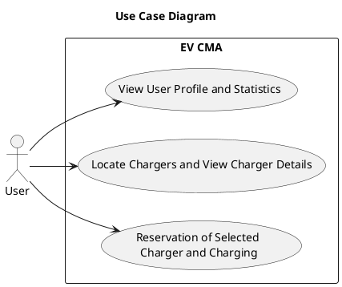

#### 3.1.1 Use case 1: Reservation of Selected Charger and Charging

This use case covers the full workflow of reserving an available charger, initiating charging after successful payment pre-authorization, monitoring the session, and finalizing payment and session data upon completion.  

##### 3.1.1.1 Roles involved

- User      
*Primary users are electric vehicle users interested in charging their vehicles, price information or relative statistics.*

##### 3.1.1.2 Preconditions
- The application must be running.
  - The user is authenticated and has an active session in the system.
  - A specific charger has been selected by the user and is currently available for reservation.
  - The user has valid payment information stored or available for use.

##### 3.1.1.3 Enviroment
#####  Execution Enviroment
The execution environment for this use case is the graphical user interface (GUI). This interface provides all the required buttons and controls to facilitate user interactions.  
##### Operating Environment
- **Frontend**: Modern browsers (e.g. Chrome, Opera, Safari).  
- **Backend**: Application Server with Node.js or Python runtime and database server(s) as needed.  
- **Network**: Internet connectivity required for service offering. 

##### 3.1.1.4 Input data

- **User-provided inputs**
  - Selected charger  
  - Selected reservation duration (e.g., up to 60 minutes)  
  - Check-in confirmation upon arrival  
  - Selected payment method for pre-authorization  
  - “Start Charging” action  
  - Optional “Stop Charging” action during session  

- **System-retrieved inputs**
  - Real-time charger availability  
  - Charger operational status and telemetry (energy delivered, power level)  
  - User’s stored payment methods  
  - Pre-authorization response from payment provider  
  - Live charging session updates (energy, time, cost estimate)  

- **External inputs**
  - Payment provider’s pre-authorization and final charge response  
  - Charger hardware signals/data during charging session  

##### 3.1.1.5 Expected behaviour 

###### **Main flow**

**Step 1:  Reservation Initiation** The user selects the option “Reserve Charger” from within the application. The system retrieves the available time slots (e.g., a maximum of 60 minutes) and prompts the user to select the desired reservation duration.

  **Step 2: Duration Selection** The user chooses the desired reservation duration. The system verifies that the selected duration is within the allowed limits (e.g., cannot exceed 60 minutes). If the selection is invalid, the user is asked to select again.

  **Step 3: Availability Re-Check**  Before finalizing the reservation, the system performs a real-time availability check for the selected charger.
  - If the charger is still available, the reservation is confirmed.
  - If the charger is no longer available (e.g., taken by another user), the system informs the user and prompts them to select a new charger.
  
  
  **Step 4: Reservation Waiting Period** Once the reservation is confirmed, the user is given a time window to reach the charger. The system displays the remaining time until reservation expiration. If the user does not arrive before the countdown ends, the reservation is automatically canceled.  

  **Step 5: User Arrival & Payment Pre-Authorization** Upon arrival at the charger, the user checks in by confirming presence via the application. At this point, the system initiates payment pre-authorization using the user’s selected payment method.
  
  - If the pre-authorization succeeds, the user may proceed.
  - If it fails, the system allows the user to retry using another payment option or cancels the session.

  **Step 6: Start Charging Session** If the payment is successfully pre-authorized, the user selects the option “Start Charging”. The system activates the charger and the charging session begins. Progress information (energy delivered, charging time, cost estimation) is displayed to the user in real time.

  **Step 7: Charging Session Monitoring** While the charging session is active:
    - The user may choose to manually stop charging.
    - The user’s battery may become fully charged.
    - The prepaid amount (if applicable) may be exhausted.

  During charging, the system continuously updates the user with real-time progress (charging percentage, energy delivered, time, cost). These updates are also sent to the backend.
  
  **Step 8: Charging Session Termination** Charging stops when:
  - The user manually ends the charging session, or
  - The system automatically ends the session (battery full, prepaid amount used up, or any other system condition).

  Once charging ends, the system:
  - Calculates the final cost based on the actual energy consumed.
  - Captures the final payment amount.

  **Step 9: Post-Charging Processing** After charging is completed and the final payment is processed, the system:
  - Calculates the total charging time.
  - Calculates the total cost.
  - Issues the final receipt to the user.
  - Stores the charging session in the user’s charging history.

###### **Alternate flows**  
 - A1 – User selects invalid reservation duration   
*System prompts the user to re-enter a valid duration.*

- A2 – Charger becomes unavailable before confirmation  
*System notifies the user and suggests selecting another charger.*

- A3 – Payment pre-authorization fails  
*User may retry with a different payment method.
If all attempts fail, the session is cancelled.*

- A4 – User does not arrive before the reservation expires
*Reservation is cancelled automatically.
System notifies the user.*

##### 3.1.1.6 Output data and postconditions

- The charging session has ended (either by user action or automatically) and the charger is released and marked as available for other users.
- The final energy consumption, total charging time and total cost have been calculated and stored in the system.
- The user’s payment has been processed successfully (or the session has been cancelled if payment failed).
- A digital receipt has been issued and is available to the user.
- The completed charging session has been added to the user’s charging history and can be used for future statistics and reporting.

##### 3.1.1.7 Notes
First Case Activity Diagram
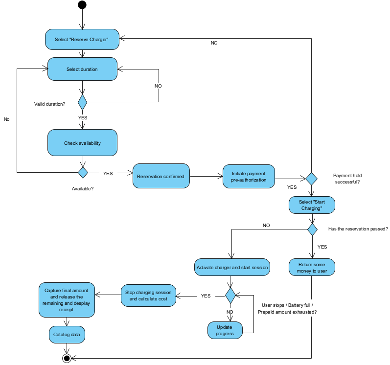

#### 3.1.2 Use case 2: Charger Discovery and Selection

This use case covers the workflow of discovering available chargers on the map, applying filters to refine search results, selecting a charger, and viewing detailed information about the selected charger.

##### 3.1.2.1 Roles involved

- User  
*Primary users are electric vehicle users interested in charging their vehicles, price information or relative statistics.*

##### 3.1.2.2 Preconditions
- The application must be running.
  - The user is authenticated and has an active session in the system.
  - The system has access to the database of chargers and their status.
  - Location services or map access permissions (if required) are enabled.

##### 3.1.2.3 Enviroment
###### Execution Environment
The execution environment for this use case is the graphical user interface (GUI). This interface provides all the required buttons and controls to facilitate user interactions.  
###### Operating Environment
- **Frontend**: Modern browsers (e.g. Chrome, Opera, Safari).  
- **Backend**: Application Server with Node.js or Python runtime and database server(s) as needed.  
- **Network**: Internet connectivity required for service offering. 

##### 3.1.2.4 Input data

- **User-provided inputs**
  - Map interactions (pan, zoom, region selection)  
  - Selected filter criteria (connector type, power rating, price range, availability, distance)  
  - Manual search query or selected area  
  - Selected charger from map or list  

- **System-retrieved inputs**
  - User’s current location (if permitted)  
  - Charger list from backend  
  - Real-time charger status (available, in use, offline)  
  - Charger technical details (power rating, connectors, tariffs)  
  - Distance calculations between user and chargers  

- **External inputs**
  - Map rendering data from the map provider  
  - Location services data (GPS or browser geolocation API)  

##### 3.1.2.5 Expected behaviour

###### **Main flow**

**Step 1: Map Initialization** The user opens the application (Web or Mobile). The system retrieves the user's location (if applicable) and loads the main map view, displaying chargers within the region.

**Step 2: Apply Filters** The user applies filters (e.g., charger type, plug type, power rating, availability). The system requests updated charger data from the backend based on the selected filters.

**Step 3: Display Filtered Chargers** The system displays updated markers on the map, showing only the chargers that meet the filtering criteria. If no chargers match the filters, the system informs the user.

**Step 4: Select a Charger** The user selects a charger from the map. The system identifies the charger ID and fetches detailed information from the backend.

**Step 5: View Charger Details** The system displays full charger information, including:
- Charger status (available, in use, offline)
- Technical specifications (power rating, connector type, charging speed)
- Estimated cost for charging
- Distance from the user
- Address and navigation option  
The user may proceed to the next actions (e.g., reserving the charger — handled in Use Case 1).

###### **Alternate flows**  
- A1 — Backend fails to return charger data  
  *The system displays an error message and prompts the user to retry.*

- A2 — No chargers match the applied filters  
  *The system displays a message indicating “No chargers found,” and offers the option to reset or modify filters.*

- A3 — Selected charger becomes unavailable before details are loaded  
  *The system notifies the user that the charger is no longer available and updates the map.*

- A4 — Location services unavailable (for mobile use)  
  *The map loads without user location and displays chargers only based on a broader view or user-adjusted map area.*

##### 3.1.2.6 Output data and postconditions

- The system has successfully displayed chargers on the map according to the user’s selected filters.
- The user has viewed detailed information about the selected charger, including availability, technical specifications, and estimated cost.
- Any updates to charger status or availability have been reflected in the system’s map view.
- The user is able to proceed seamlessly to further actions (e.g., reservation in Use Case 1) based on the displayed charger information.
- The system has logged any errors encountered (e.g., failed data retrieval) for backend monitoring and diagnostics.
- The user may proceed to the next steps, such as making a reservation or starting a charging session.

- A digital receipt has been issued and is available to the user.
- The completed charging session has been added to the user’s charging history and can be used for future statistics and reporting.

##### 3.1.2.7 Notes
Second Case Activity Diagram

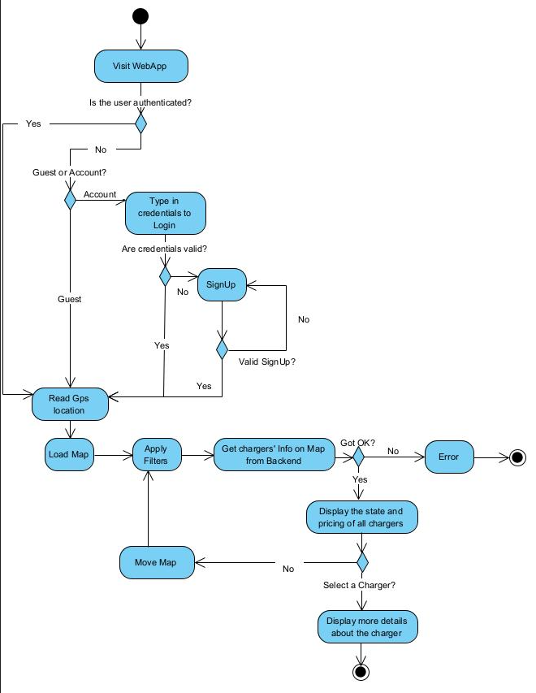
---
 

#### 3.1.3 Use case 3: User Profile and Charging Statistics

This use case describes how an authenticated user accesses their profile page and views both their basic account information and their charging statistics. The system retrieves the user’s details and historical charging data, validates access, and displays summarized and detailed statistics such as past sessions, total energy consumption, cost summaries, and long-term usage trends.

##### 3.1.3.1 Roles involved

- User  
*Primary users are electric vehicle users interested in charging their vehicles, price information or relative statistics.*    

##### 3.1.3.2 Preconditions
- The application must be running.
  - The user is authenticated and has an active session in the system.
  - The system has access to the user’s stored profile information.
  - The statistics module has access to historical charging data for the user.

##### 3.1.3.3  Environment
###### Execution Enviroment
The execution environment for this use case is the graphical user interface (GUI). This interface provides all the required buttons and controls to facilitate user interactions.  
#### 3.1.1.3.1 Operating Environment
- **Frontend**: Modern browsers (e.g. Chrome, Opera, Safari).  
- **Backend**: Application Server with Node.js or Python runtime and database server(s) as needed.  
- **Network**: Internet connectivity required for service offering. 

##### 3.1.3.4 Input data

- **User-provided inputs**
  - User selection of the “Profile” or “Statistics” section  
  - Optional navigation actions within the profile (e.g., switching tabs, selecting charts, opening payment methods)

- **System-retrieved inputs**
  - User’s stored profile information (name, email, preferences, payment methods, vehicle info)  
  - Historical charging data for the user  
  - Aggregated statistics (total sessions, total energy consumed, total cost, usage summaries)  
  - Time-based summaries (monthly consumption, long-term patterns)  
  - Visualization data required for charts and summaries  

- **External inputs**
  - None directly; all data accessed through backend services 
#### 3.1.3.5 Expected behaviour

###### **Main flow**

**Step 1: Access Profile Section** The user selects the “Profile” or “Account” option from the application menu (web or CLI). The system loads the profile settings page and prepares to fetch user-related information.

**Step 2: Retrieve Basic Profile Information** The system requests the user’s profile data (name, email, preferences, payment methods, etc.) from the backend. If retrieval is successful, the system displays the basic profile information.

**Step 3: Request User Statistics** In parallel with displaying the basic profile data, the system initiates a request to fetch the user’s charging statistics from the backend. These may include:
- Number of charging sessions
- Total energy consumed
- Total cost paid
- Average session duration
- Monthly or long-term summaries

**Step 4: Display Statistics** If the statistics retrieval is successful, the system displays:
- Historical charts
- Consumption summaries
- Cost breakdown
- Comparative or long-term usage patterns  
This enables the user to review their energy usage, expenses, and charging behavior.

**Step 5: User Navigation** The user may choose to:
- Return to the main page
- Review more detailed data
- Modify account settings
- Or exit the profile section  
The use case ends when the user leaves the profile/statistics page.

###### **Alternate flows**  
- A1 — Failed Retrieval of Profile Information  
  *The system displays an error message and prompts the user to retry. Basic profile information is not displayed until retrieval succeeds.*

- A2 — Failed Retrieval of User Statistics  
  *If the system cannot retrieve statistics:  
  Only basic profile information is shown.  
  The statistics section displays an error or “No data available.”  
  The user may retry the operation.*

- A3 — No Historical Data Available  
  *If the user has not completed any charging sessions:  
  The statistics section displays “No charging history found.”  
  The user is still able to view basic profile information.*

##### 3.1.3.6 Output data and postconditions

- The user’s basic profile information has been successfully retrieved and displayed, provided backend access was available.
- Charging statistics have been retrieved and displayed, or the system has indicated that no data is available or an error occurred.
- The system has updated the profile and statistics interface with the most recent data stored in the backend.
- Any failed retrieval attempts (profile or statistics) have been logged for backend monitoring and diagnostics.
- The user has exited the profile/statistics section and returned to another part of the application or closed the session.

##### 3.1.3.7 Notes

Third Case Activity Diagram
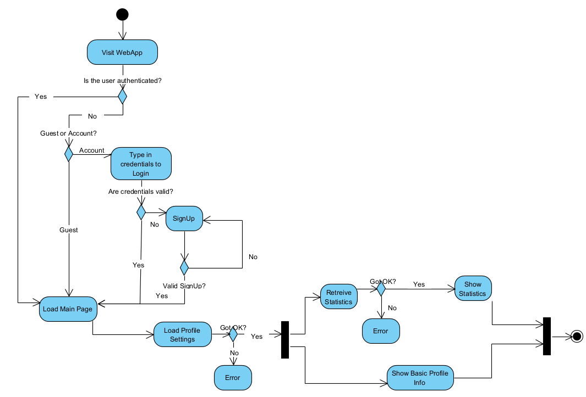

### 3.2 Functional Requirements
 
##### Functional Requirements Diagram
```plantuml
    @startuml
    title Functional Requirements Diagram
    scale 0.5
left to right direction
skinparam packageStyle rectangle

actor "User" as User
actor "Admin (CLI)" as Admin
actor "Payment Provider" as PSP
actor "Navigation App" as NavApp

rectangle "EV Charging Management System" {

  ' --- User Functional Requirements ---
  usecase "FR-1: User Registration" as FR1
  usecase "FR-2: User Login" as FR2
  usecase "FR-3: User Profile Selection" as FR3
  usecase "FR-4: Fetch User Statistics" as FR4

  usecase "FR-8: View Chargers on Map/List" as FR8
  usecase "FR-9: Search / Filter Chargers" as FR9
  usecase "FR-10: View Charger Details" as FR10
  usecase "FR-11: Navigation to Charger" as FR11

  usecase "FR-5: Reserve Charger" as FR5
  usecase "FR-6: Payment Handling" as FR6
  usecase "FR-12: Manage Payment Methods" as FR12

  usecase "FR-7: Start Charging" as FR7
  usecase "FR-13: Session Monitoring" as FR13
  usecase "FR-14: Stop Charging" as FR14
  usecase "FR-15: Session History & Bills" as FR15
  usecase "FR-16: Data Cataloging" as FR16


  ' --- Admin CLI Requirements ---
  usecase "FR-17: Admin Login (CLI)" as FR17
  usecase "FR-18: Add New Charger (CLI)" as FR18
  usecase "FR-19: Modify Charger Config (CLI)" as FR19
  usecase "FR-20: View Charger Status (CLI)" as FR20
  usecase "FR-21: Retrieve Statistics / Reports (CLI)" as FR21
}

' ======================
'   USER RELATIONS
' ======================

User --> FR1
User --> FR2
User --> FR3
User --> FR4

User --> FR8
User --> FR9
User --> FR10
User --> FR11

User --> FR5
User --> FR6
User --> FR12

User --> FR7
User --> FR13
User --> FR14
User --> FR15

' Payment handling invoked by payment provider
FR6 --> PSP : <<include>>

' Charger details required before reservation
FR5 --> FR10 : <<include>>

' Monitoring requires active charging
FR13 --> FR7 : <<include>>

' Session history requires data cataloging
FR15 --> FR16 : <<include>>

' Navigation uses external app
FR11 --> NavApp : <<include>>

' Filters extend the map view
FR9 --> FR8 : <<extend>>


' ======================
'   ADMIN RELATIONS
' ======================

Admin --> FR17
Admin --> FR18
Admin --> FR19
Admin --> FR20
Admin --> FR21

' Admin management usually includes login
FR18 --> FR17 : <<include>>
FR19 --> FR17 : <<include>>
FR20 --> FR17 : <<include>>
FR21 --> FR17 : <<include>>

@enduml

 ``` 

#### 3.2.1 Functional UI Requirements Specification

FR-1: User Registration 

*The system shall allow a new user to sign up (create account with credentials, basic info, car info, etc.).*


FR-2: User Login 

*The system shall allow users to log in using valid credentials and authenticate their identity before accessing any personalized functionality.*

FR-3: User Profile Selection

*The system shall allow authenticated users to access and manage their personal profile settings, including preferences, payment methods, and vehicle details.*

FR-4: Fetch User Statistics

*The system shall retrieve and display key usage statistics for the user, such as past charging sessions, total energy consumed, and cost summaries.*

FR-5: Reserve Charger

*The system shall allow users to reserve an available charger for a selected time period and ensure the charger remains locked for their use.*

FR-6: Payment Handling

*The system shall process payment operations, final cost calculation, and charging the user based on actual energy consumption.*

FR-7: Start Charging

*The system shall enable users to initiate a charging session once they arrive at the selected charger and the prepayment has been completed.*

FR-8: View Chargers on Map/List 

*The system shall show available chargers and their prices on a map (or list) around the user’s GPS position or a selected area.*

FR-9: Search / Filter Chargers

*The system shall allow the user to apply filters (e.g. connector type, power, price range, distance, availability) and update the map/list accordingly.*

FR-10: Select Charger and View Charger Details

*The system shall display detailed info for a selected charger (location, connectors, max power, current status, pricing rules, opening hours, etc.).*

FR-11: Navigation to Charger

*The system shall be able to hand off the charger location to an external navigation app (e.g. Google Maps)*

FR-12: Manage Payment Methods & Preferences

*The system shall allow the user to add/remove/update payment methods and set defaults.*

FR-13: Charging Session Monitoring

*During an active session, the system shall periodically update and display progress (energy delivered, elapsed time, estimated cost, remaining prepaid amount).*

FR-14: User-initiated Stop Charging

*The system shall allow the user to stop an ongoing charging session at any time and calculate the cost up to that point.*

FR-15: Session History & Bills

*The system shall provide detailed session history and bills for the last 6 months and aggregated statistics for longer periods.*

FR-16: Data Cataloging of Sessions

*The system shall store all charging sessions (start/end time, station, chargerID, energy, cost, user) for later reporting and statistics.*

#### 3.2.2 Functional Admin-CLI Requirements Specification

FR-17: Admin Login via CLI
*The system shall provide a secure CLI interface where an admin can authenticate with admin credentials.*

FR-18: Add New Charger (CLI)
*Through the CLI, the admin shall be able to add a new charger (location, capabilities, tariffs, initial status) with validation and database update.*

FR-19: Modify Charger Configuration/Status (CLI)
*Through the CLI, the admin shall be able to modify charger info (tariffs, availability, technical parameters) and update the database.*

FR-20: View Charger Status (CLI)
*The CLI shall allow querying the current status of a charger (online/offline, in use, fault codes) and display the information.*

FR-21: Retrieve Network Statistics / Reports (CLI)
*The CLI shall allow the admin to retrieve and display aggregated statistics (number of sessions, total energy, revenue, usage per charger, etc.).*


### 3.3 Performance requirements

##### Performance Requirements Diagram
```plantuml
@startuml
title Performance Requirements Diagram

' Relationships show thematic dependencies
[PR-1 Response Time (UI)] --> [PR-4 Concurrency Handling] : affected by
[PR-4 Concurrency Handling] --> [PR-7 Scalability] : supports
[PR-7 Scalability] --> [PR-10 Resource Utilization] : depends on
[PR-3 Charger Data Refresh Rate] --> [PR-8 Data Consistency & Latency] : ensures
[PR-5 Reservation Conflict Resolution] --> [PR-8 Data Consistency & Latency] : maintains
[PR-6 Payment Processing Throughput] --> [PR-10 Resource Utilization] : constrained by
[PR-9 API Response Time] --> [PR-4 Concurrency Handling] : impacted by

@enduml
``` 

#### 3.3.1 Performance Requirements Specification
PR-1: Response Time (UI)
*For 95% of requests, the system shall respond to user actions, such as loading the map, searching chargers, or reserving a slot, within 2 seconds under normal load.*

PR-2: Map Loading Time
*The initial map view with charger data around the user shall be fully interactive within 3 seconds after login or page load.*

PR-3: Charger Data Refresh Rate
*The system shall refresh charger status (availability, in-use, offline) every 30 seconds to ensure up‑to‑date information.*

PR-4: Concurrency Handling
*The system shall support at least 500 concurrent user sessions without degradation beyond the specified response-time thresholds.*

PR-5: Reservation Conflict Resolution
*The system shall guarantee atomicity of reservation operations. Two users cannot reserve the same charger simultaneously.*

PR-6: Payment Processing Throughput
*Payment processing (authorization → confirmation) shall complete within 5 seconds in 95% of cases, given normal network conditions.*

PR-7: Scalability
*The system shall be designed to scale horizontally to handle up to 5× baseline user load without major architectural changes.*

PR-8: Data Consistency and Latency
*All user or charger status updates shall propagate to all relevant views and APIs within 2 seconds of completion.*

PR-9: API Response Time (for Third-party Integrations)
*The public API for charger status shall deliver responses within 1 second for up to 50 requests per second.*

PR-10: Resource Utilization
*During normal operation, average server CPU utilization shall stay below 70% and memory utilization below 75%, ensuring capacity for traffic peaks.*

### 3.4 Data requirements

The system accesses and manages data through a combination of internal components, external services, and physical charger devices. This section describes the sources of data, technologies used, communication protocols, and authentication mechanisms.

---

#### 3.4.1 Data access requirements
DAR-1: Relational Database  
*The system shall store all persistent domain data (users, chargers, reservations, charging sessions, tariffs, payments, analytics) in a relational database that is accessible only through the backend service.*

DAR-2: Backend Service as Access Layer  
*The system shall use the backend service as the single access layer for all data, exposing REST endpoints for frontend, mobile clients, and CLI.*

DAR-3: EV Charger Telemetry Access  
*The system shall retrieve operational status and telemetry from EV chargers (availability, energy delivered, power level) via provider-specific protocols.*

DAR-4: EV Charger Control Access  
*The system shall send operational commands to EV chargers (e.g., “start session,” “stop session”) through secure provider APIs or protocols.*

DAR-5: Payment Service Provider Access  
*The system shall communicate with the payment service provider for pre-authorisation, final charging, and refunds through a secure web API.*

DAR-6: External Information Providers Access  
*The system shall access external providers for dynamic data such as wholesale electricity prices or navigation-related information.*

DAR-7: CLI Data Access  
*The system shall allow the CLI to access system data exclusively through the REST API and dedicated provider-admin endpoints.*

---

#### 3.4.2 Technologies and Communication Protocols

DAR-8: REST API Layer  
*The system shall support communication over HTTPS using JSON request/response format and standard HTTP methods (GET/POST/PUT/DELETE).*

DAR-9: Database Access Layer  
*The system shall ensure that only the backend can communicate with the SQL database through an ORM or database driver, with no direct client access.*

DAR-10: Device Integration Layer  
*The system shall abstract charger communication at the backend layer using HTTP(S), MQTT, WebSockets, or vendor-specific protocols.*

DAR-11: External Service Integration  
*The system shall access external services (e.g., payment provider, pricing API) via secure API keys and HTTPS connections.*

---

#### 3.4.3 Authentication and Authorisation

DAR-12: User Authentication  
*The system shall authenticate users using username/password and represent sessions via tokens (JWT or session ID) required for all user-specific API operations.*

DAR-13: Provider/Admin Authentication  
*The system shall require a separate authentication mechanism for provider/admin access through the CLI, enforcing role-based access control at the API level.*

DAR-14: Service-to-Service Authentication  
*The system shall authenticate communication with external systems (payment provider, pricing services) using API keys or client secrets stored securely (environment variables or vault).*

#### 3.4.4  Semantic data model

##### Semantic data model Diagram

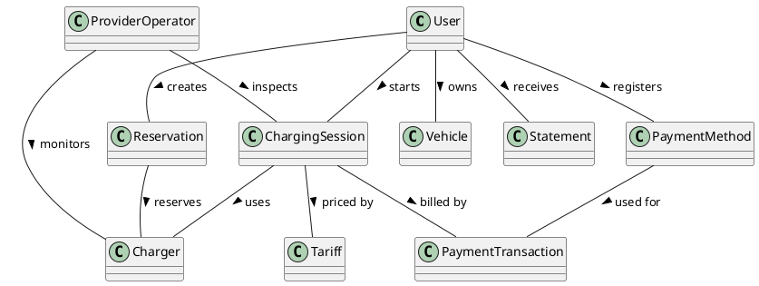

### 3.5 Other requirements

#### 3.5.1 Availability Requirements
##### Availability Requirements Diagram – Relationship Overview
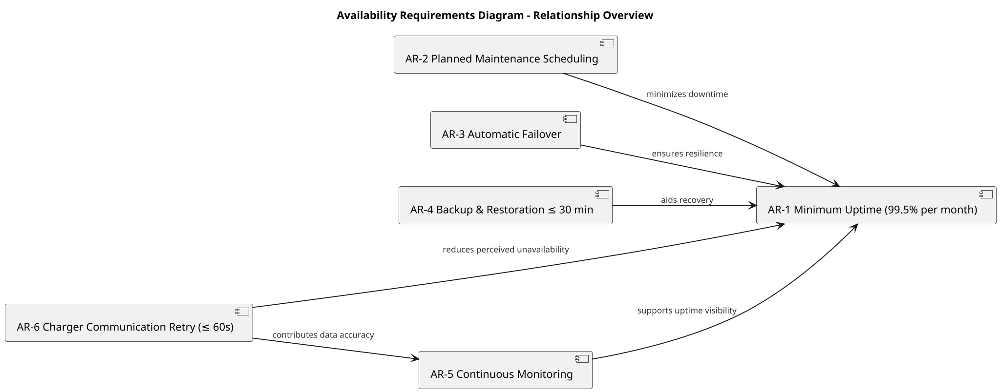
#### 3.5.1.1 Availability Requirements Specification
AR‑1: *The system shall maintain a minimum 99.5 % uptime per month, excluding planned maintenance not exceeding 30 minutes per month.*

AR‑2: *Planned maintenance windows shall be scheduled outside peak usage hours and announced at least 24 hours in advance.*

AR‑3: *The system shall support automatic failover between redundant servers to minimize user disruption.*

AR‑4: *Backup procedures shall guarantee full restoration of operational data (users, chargers, sessions, payments) within 30 minutes in the event of system failure.*

AR‑5: *All service components (web server, API, payment gateway) shall be continuously monitored for health and availability.*

AR‑6: *In case of communication failure with a charger, the system shall retry for up to 60 seconds and mark the charger status as temporarily unavailable if retries fail.*

#### 3.5.2 Security Requirements
##### Security Requirements Diagram – Relationship Overview 
```plantuml
@startuml
title Security Requirements Diagram – Relationship Overview 

skinparam dpi 150
skinparam node {
  BackgroundColor #FFF9F9
  BorderColor #777
  FontStyle bold
  FontSize 15
  Padding 10
}
skinparam arrow {
  FontSize 15
  FontColor #333
  Thickness 1.2
}
left to right direction
skinparam ranksep 20
skinparam nodesep 30

' --- Security Requirement Nodes ---
[SR-1 Secure Communication (TLS 1.3+)]
[SR-2 Data Encryption (AES-256)]
[SR-3 Password Hashing (bcrypt)]
[SR-4 Role-Based Access Control (RBAC)]
[SR-5 Admin CLI MFA + Command Logging]
[SR-6 Session Timeout (15 min inactivity)]
[SR-7 PCI-DSS Compliant Payments (Tokenized)]
[SR-8 Input Sanitization (SQLi/XSS Protection)]
[SR-9 Secure Account Recovery (Email Verification, Reset)]
[SR-10 Privacy & Compliance (GDPR, Local Regulations)]

' --- Thematic Relationships and Dependencies ---

' Core data protection chain
[SR-1 Secure Communication (TLS 1.3+)] --> [SR-2 Data Encryption (AES-256)] : protects data in transit & at rest
[SR-2 Data Encryption (AES-256)] --> [SR-10 Privacy & Compliance (GDPR, Local Regulations)] : supports compliance
[SR-3 Password Hashing (bcrypt)] --> [SR-10 Privacy & Compliance (GDPR, Local Regulations)] : supports privacy standards

' Access control and authentication
[SR-4 Role-Based Access Control (RBAC)] --> [SR-5 Admin CLI MFA + Command Logging] : strengthens privileged access
[SR-5 Admin CLI MFA + Command Logging] --> [SR-10 Privacy & Compliance (GDPR, Local Regulations)] : audit & traceability
[SR-6 Session Timeout (15 min inactivity)] --> [SR-4 Role-Based Access Control (RBAC)] : reinforces access limits
[SR-9 Secure Account Recovery (Email Verification, Reset)] --> [SR-4 Role-Based Access Control (RBAC)] : ties to authentication flow

' Transaction and injection security
[SR-7 PCI-DSS Compliant Payments (Tokenized)] --> [SR-10 Privacy & Compliance (GDPR, Local Regulations)] : ensures lawful processing
[SR-8 Input Sanitization (SQLi/XSS Protection)] --> [SR-1 Secure Communication (TLS 1.3+)] : complements against attack surface

@enduml
```

#### 3.5.2.1 Security Requirements Specification
SR‑1: *All client–server communication shall use TLS 1.3 or higher to protect data in transit.*

SR‑2: *Sensitive data (passwords, payment tokens, personal information) shall be stored with AES‑256 encryption or equivalent.*

SR‑3: *User passwords shall be stored in a hashed and salted format following bcrypt or a comparable algorithm.*

SR‑4: *The system shall implement role‑based access control (RBAC) separating user, operator, and admin privileges.*

SR‑5: *The admin CLI shall require multi‑factor authentication and log all executed administrative commands.*

SR‑6: *Sessions shall automatically expire after 15 minutes of inactivity.*

SR‑7: *Payment processing shall comply with PCI‑DSS standards and use secure, tokenized transactions. No credit‑card details shall be stored locally.*

SR‑8: *The system shall sanitize all user input to protect against SQL injection, cross‑site scripting (XSS), and related vulnerabilities.*

SR‑9: *The system shall provide mechanisms for account recovery (email verification and password reset) without exposing sensitive information.*

SR‑10: *All data handling shall comply with GDPR or relevant local privacy regulations.*

